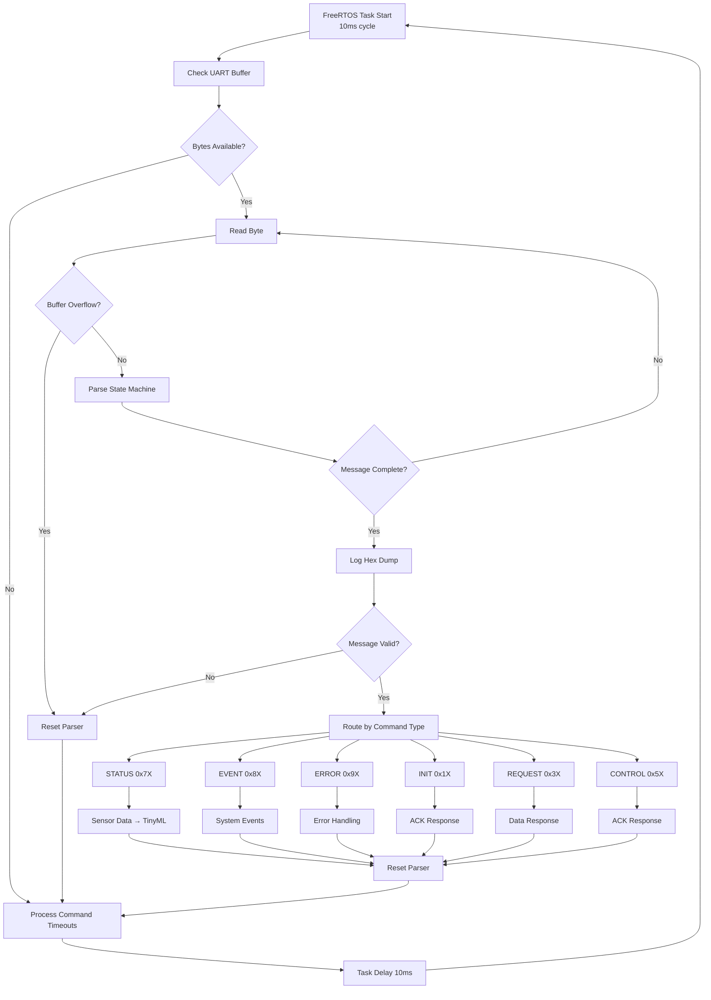
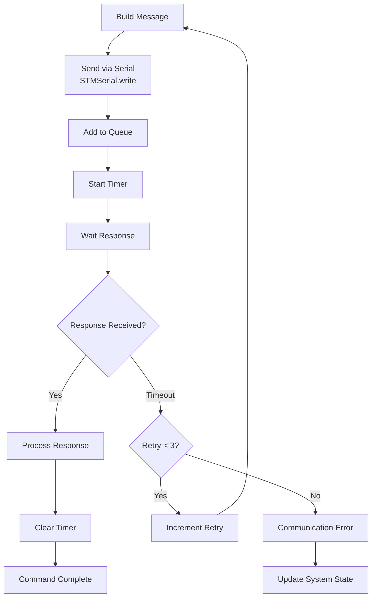
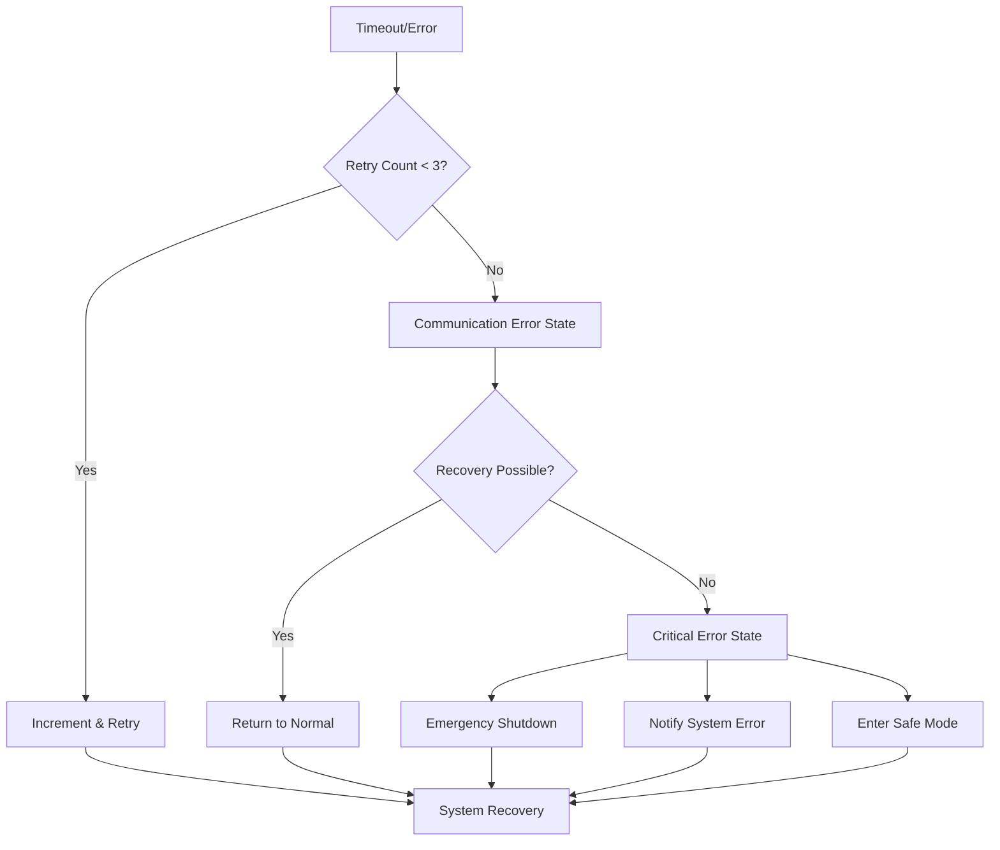

# uartMaster Module Guide

## Overview
ESP32-STM32 UART communication module for PSA (Postural Stability Assistant) device. Handles bidirectional communication, sensor data processing, and device control with automatic error recovery.

```mermaid
graph LR
    ESP32[ESP32<br/>uartMaster] ←→|UART| STM32[STM32<br/>Controller]
    STM32 ←→|I/O| Sensors[Sensors/<br/>Actuators]
    ESP32 → TinyML[TinyML<br/>Processing]
    STM32 → Control[Real-time<br/>Control]
```

## Protocol Specification

### Message Format
```
[STM][LEN][DIR][CMD][DATA...][CHKSUM][ETX]
 02    XX   XX   XX   ......    XX     03
```

- **STM**: Start byte (0x02)
- **LEN**: Message length (DIR+CMD+DATA+CHKSUM+ETX)
- **DIR**: Direction (0x20=Request, 0x02=Response)  
- **CMD**: Command code (see below)
- **DATA**: Payload data (0-64 bytes)
- **CHKSUM**: XOR checksum (initial: 0xA5)
- **ETX**: End byte (0x03)

### Complete Protocol Command Reference

| Code | Command | Type | Description | Data Format |
|------|---------|------|-------------|-------------|
| **INIT Commands - Device Setup (ESP32 → STM32)** |||||
| 0x10 | initTempSleep | INIT | Set sleep mode temperature | [int][dec] temp in °C |
| 0x11 | initTempWaiting | INIT | Set waiting mode temperature | [int][dec] temp in °C |
| 0x12 | initTempForceUp | INIT | Set force-up mode temperature | [int][dec] temp in °C |
| 0x13 | initTempHeatPad | INIT | Set heat pad temperature | [int][dec] temp in °C |
| 0x14 | (Reserved) | INIT | - | - |
| 0x15 | initPWMCoolFan | INIT | Set cooling fan PWM level | [level] 0-255 |
| 0x16 | initTout | INIT | Set timeout values | [timeout_ms] |
| 0x17 | initDelay | INIT | Set detection delay values | [delay_ms] |
| **REQUEST Commands - Data Query (ESP32 → STM32)** |||||
| 0x30 | reqTempSleep | REQUEST | Get sleep mode temperature | None → [int][dec] |
| 0x31 | reqTempWaiting | REQUEST | Get waiting mode temperature | None → [int][dec] |
| 0x32 | reqTempForceUp | REQUEST | Get force-up mode temperature | None → [int][dec] |
| 0x33 | reqTempHeatPad | REQUEST | Get heat pad temperature (DEPRECATED) | None → [int][dec] |
| 0x34 | reqUpperTemp | REQUEST | Get upper temperature limit | None → [int][dec] |
| 0x35 | reqPWMCoolFan | REQUEST | Get cooling fan PWM level | None → [level] |
| 0x36 | reqTimeout | REQUEST | Get timeout values | None → [timeout_ms] |
| 0x37 | reqSpk | REQUEST | Get speaker volume | None → [volume] 0-10 |
| 0x38 | reqDelay | REQUEST | Get detection delay values | None → [delay_ms] |
| **CONTROL Commands - Real-time Control (ESP32 → STM32)** |||||
| 0x50 | ctrlReset | CONTROL | Reset device | None |
| 0x51 | ctrlMode | CONTROL | Set device operating mode | [mode] 0-6 (see Device Modes) |
| 0x52 | ctrlSpkVol | CONTROL | Set speaker volume | [volume] 0-10 |
| 0x53 | ctrlFanOn | CONTROL | Turn main fan on/off | [state] 0=off, 1=on |
| 0x54 | ctrlFanPWM | CONTROL | Set main fan speed | [speed] 0-3 |
| 0x55 | ctrlCoolFanOn | CONTROL | Turn cooling fan on/off | [state] 0=off, 1=on |
| 0x56 | ctrlCoolFanPWM | CONTROL | Set cooling fan PWM level | [level] 0-255 |
| 0x57 | ctrlHeatPadOn | CONTROL | Turn heat pad on/off | [state] 0=off, 1=on |
| 0x58 | ctrlHeatPadTemp | CONTROL | Set heat pad temperature | [int][dec] temp in °C |
| 0x59 | ctrlPose | CONTROL | Enable/disable pose detection | [state] 0=off, 1=on |
| **STATUS Commands - Data Stream (STM32 → ESP32)** |||||
| 0x70 | statMessage | STATUS | Sensor data message from STM | 34 bytes sensor data |
| **EVENT Commands - System Events (STM32 → ESP32)** |||||
| 0x80 | evtInitStart | EVENT | Initialization started event | None |
| 0x81 | evtInitResult | EVENT | Initialization result event | [result] 0=fail, 1=success |
| 0x82 | evtMode | EVENT | Device mode change event | [new_mode] 0-6 |
| **ERROR Commands - Error Reports (STM32 → ESP32)** |||||
| 0x90 | errInit | ERROR | Initialization error | [error_code] |

### Command Categories

| Category | Range | Purpose | Examples |
|----------|-------|---------|----------|
| **INIT** | 0x10-0x1F | Setup parameters | 0x10=Sleep temp, 0x11=Wait temp |
| **REQUEST** | 0x30-0x3F | Query values | 0x30=Get sleep temp, 0x37=Get volume |
| **CONTROL** | 0x50-0x5F | Real-time control | 0x51=Set mode, 0x54=Fan speed |
| **STATUS** | 0x70-0x7F | Sensor data | 0x70=Sensor data stream |
| **EVENT** | 0x80-0x8F | System events | 0x82=Mode changed |
| **ERROR** | 0x90-0x9F | Error reports | 0x90=Init error |

### Device Modes
- **SLEEP** (0): Power saving
- **WAITING** (1): Ready for user
- **FORCE_UP** (2): Raising posture
- **FORCE_ON** (3): Maintaining posture  
- **FORCE_DOWN** (4): Lowering posture
- **IMU** (5): Motion tracking
- **ERROR** (6): System error

## System Flowchart

### Main Communication Loop (usartMasterHandler)


### ESP32 → STM32 Command Flow


### Error Recovery Strategy


## Usage Guide

### 1. Initialization
```cpp
#include "uartMaster.h"

void setup() {
    // Initialize UART communication
    if (initUartMaster()) {
        ESP_LOGI("APP", "UART Master initialized successfully");
    } else {
        ESP_LOGE("APP", "UART Master initialization failed");
    }
}
```

### 2. Device Control Functions
```cpp
// Device mode control
setDeviceMode(DeviceMode::WAITING);        // Set to waiting mode
setDeviceMode(DeviceMode::FORCE_UP);       // Start posture correction

// Fan control
setFanState(true);                         // Turn fan on
setFanSpeed(2);                           // Set speed (0-3)
setCoolingFanState(true);                 // Enable cooling fan

// Temperature settings
setSleepTemperature(25.5);                // Set sleep mode temp
setWaitingTemperature(30.0);              // Set waiting mode temp
setOperatingTemperature(35.0);            // Set operating temp

// Audio control
setSpeakerVolume(7);                      // Set volume (0-10)
```

### 3. Data Retrieval
```cpp
// Get current sensor data (34 bytes)
SensorReading sensors = getCurrentSensorData();
ESP_LOGI("APP", "Left pressure: %d", sensors.leftPressure);
ESP_LOGI("APP", "Right pressure: %d", sensors.rightPressure);
ESP_LOGI("APP", "Board temp: %d", sensors.boardTemp);

// Get system status
DeviceMode currentMode = getCurrentMode();
SystemState systemHealth = getCurrentSystemState();

// Check for errors
if (isSystemInErrorState()) {
    uint8_t errorCode = getLastErrorCode();
    ESP_LOGW("APP", "System error: %d", errorCode);
}
```

### 4. Async Parameter Requests (Non-blocking)
```cpp
// Request current settings (returns immediately)
requestSleepTemperature();                // Request sleep temp
requestCoolingFanLevel();                 // Request fan level
requestSpeakerVolume();                   // Request volume

// Use getter functions to retrieve requested values
float sleepTemp = getSleepTemperature();
uint8_t fanLevel = getCoolingFanLevel();
uint8_t volume = getSpeakerVolume();
```

### 5. Complete Usage Example
```cpp
void app_main() {
    // 1. Initialize
    initUartMaster();
    
    // 2. Setup device
    setDeviceMode(DeviceMode::WAITING);
    setSpeakerVolume(5);
    setFanState(true);
    setFanSpeed(1);
    
    // 3. Main loop
    while (1) {
        // Check system health
        if (getCurrentSystemState() == SystemState::NORMAL) {
            // Get sensor data
            SensorReading data = getCurrentSensorData();
            
            // Simple posture logic
            if (data.leftPressure > 1000 || data.rightPressure > 1000) {
                setDeviceMode(DeviceMode::FORCE_UP);
                ESP_LOGI("APP", "User detected - activating");
            }
            
            // Temperature monitoring
            if (data.boardTemp > 4500) {  // 45°C
                setCoolingFanState(true);
                ESP_LOGI("APP", "High temp - cooling activated");
            }
        } else {
            ESP_LOGW("APP", "System in error state");
        }
        
        vTaskDelay(pdMS_TO_TICKS(1000));  // 1 second loop
    }
}
```

## Testing & Debugging

### Test Function
```cpp
// Run comprehensive protocol test
testESPtoSTMCommunication();
```

### Debug Features
- **Hex dump logging**: All messages logged with hex values
- **Command tracking**: Pending commands status monitoring  
- **Timeout detection**: Automatic retry and error reporting
- **Checksum validation**: Message integrity verification

### Common Debug Commands
```cpp
// Check communication health
bool healthy = isCommunicationHealthy();

// Get command state
CommandState state = getCommandState(0x51);  // Check mode command

// Manual error recovery
bool recovered = manualRecoveryFromCriticalError();
```

## Key Configuration

### Timeouts
- **Command timeout**: 5 seconds
- **Max retries**: 3 attempts  
- **Task cycle**: 10ms
- **Critical threshold**: 5 seconds total failure

### Buffer Sizes
- **Message buffer**: 128 bytes max
- **Response buffer**: 64 bytes max
- **Pending commands**: 10 simultaneous max

This module provides robust, real-time ESP32-STM32 communication for safe and reliable posture assistance device operation.